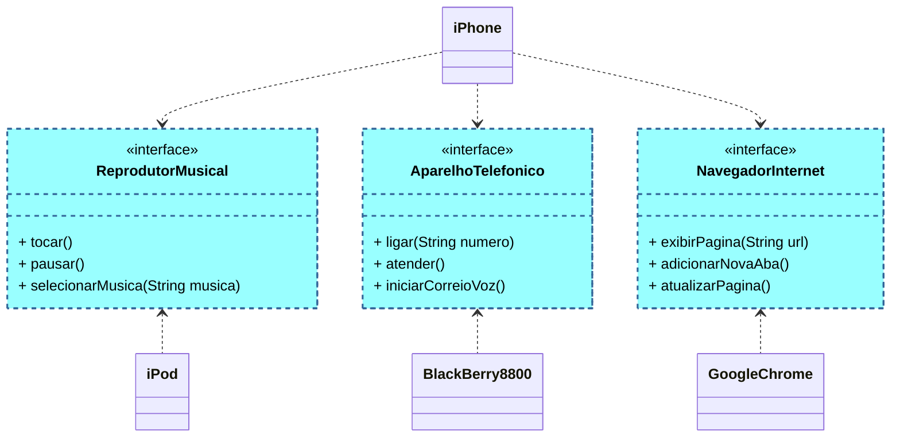

# Diagrama UML do iPhone
Modelagem e diagramação de um componente iPhone

# Diagrama

```mermaid
classDiagram

    class ReprodutorMusical {
        <<interface>>
        + tocar()
        + pausar()
        + selecionarMusica(String musica)
    }
    iPhone ..> ReprodutorMusical 
    
    class AparelhoTelefonico {
        <<interface>>
        + ligar(String numero) 
        + atender() 
        + iniciarCorreioVoz()
    }
    iPhone ..> AparelhoTelefonico 

    class NavegadorInternet{
        <<interface>>
        + exibirPagina(String url) 
        + adicionarNovaAba()
        + atualizarPagina()
    }
    iPhone ..> NavegadorInternet

    class GoogleChrome{

    }
    NavegadorInternet <.. GoogleChrome

    class iPhone {

    }

    class iPod{

    }
    ReprodutorMusical <.. iPod

    class BlackBerry8800{

    }
    AparelhoTelefonico <..BlackBerry8800
    

    style ReprodutorMusical fill:#9ff,stroke:#369,stroke-width:2px,color:#000,stroke-dasharray: 5 5
    style AparelhoTelefonico fill:#9ff,stroke:#369,stroke-width:2px,color:#000,stroke-dasharray: 5 5
    style NavegadorInternet fill:#9ff,stroke:#369,stroke-width:2px,color:#000,stroke-dasharray: 5 5
```

## Habilidades 💻
 

